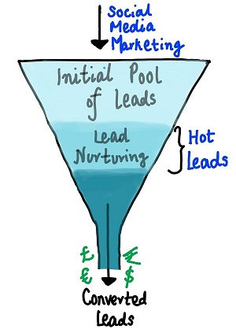

# Data Science Portfolio
---
## Machine Learning
### Lead Scoring Project
X Education need help them to select the most promising leads, i.e. the leads that are most likely to convert into paying customers. I have Build a logistic regression model to assign a lead score between 0 and 100 to each of the leads which can be used by the company to target potential leads.

